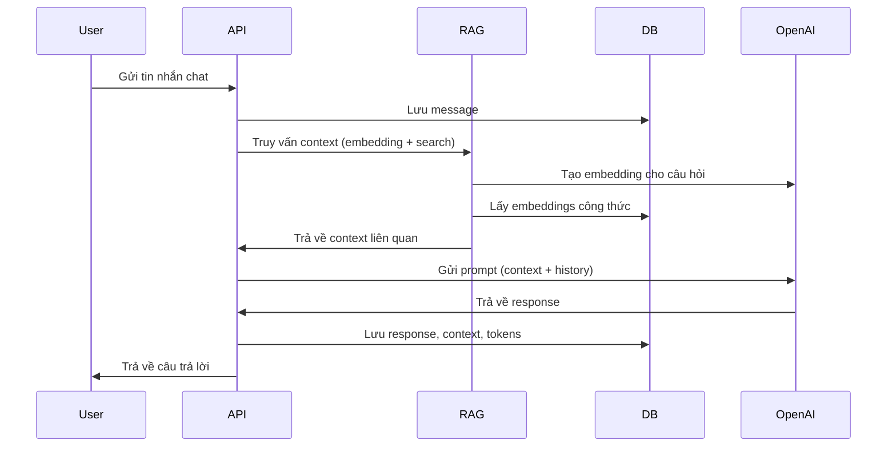

# 📚 Tài liệu Kiến trúc RAG & LangChain Backend

## 1. Tổng quan luồng xử lý chat với RAG

### Luồng xử lý chính:
1. **Người dùng gửi tin nhắn (chat hoặc search)**
2. **API nhận request và lưu message vào database**
3. **Hệ thống thực hiện truy vấn RAG:**
   - Tạo embedding cho câu hỏi bằng OpenAI
   - Tìm kiếm ngữ nghĩa (vector search) trên database (SQLite hoặc Qdrant)
   - Lấy các context liên quan (công thức, nguyên liệu, v.v.)
4. **Kết hợp context với lịch sử chat, gửi lên LLM (GPT-4o) để sinh câu trả lời**
5. **Trả về response cho người dùng, lưu lại metadata (context, tokens, v.v.)**

---

## 2. Mô tả chi tiết từng đoạn code xử lý RAG

### 2.1. Truy vấn RAG (app/services/rag.py)

- **get_rag_context**: Hàm chính lấy context cho RAG.
  - Nhận câu hỏi, tạo embedding bằng OpenAI.
  - Gọi `semantic_search_recipes` để tìm các công thức tương đồng (cosine similarity).
  - Nếu có kết quả vector search, trả về context; nếu không, fallback sang text search.

- **semantic_search_recipes**: Tìm kiếm vector bằng cosine similarity trên SQLite.
  - Lấy toàn bộ embedding từ database.
  - Tính similarity giữa embedding của câu hỏi và từng công thức.
  - Trả về danh sách context phù hợp.

- **generate_chat_response**: Sinh câu trả lời AI dựa trên context RAG.
  - Ghép context từ RAG vào prompt.
  - Gọi OpenAI để sinh response (có hỗ trợ streaming).

### 2.2. Lưu trữ & quản lý chat (app/models/chat.py, app/schemas/chat.py)

- **Chat**: Model lưu thông tin phiên chat (user, context, số lượng tin nhắn, v.v.)
- **ChatMessage**: Model lưu từng tin nhắn, role (user/assistant), context RAG, token usage, v.v.
- **Schema**: Định nghĩa request/response cho API chat, RAG, streaming.

### 2.3. Endpoint xử lý chat (app/api/v1/endpoints/chat.py)

- **send_message**: Nhận message từ user, gọi RAG để lấy context, sinh response, lưu lại vào database.
- **Streaming**: Hỗ trợ trả về response dạng stream cho UI.

---

## 3. LangChain đóng vai trò gì?

- **LangChain** được sử dụng cho các pipeline RAG nâng cao (file: app/services/langchain_rag.py).
- Kết nối với Qdrant Vector Database để thực hiện vector search hiệu quả cho production.
- Quản lý prompt, chat history, personality, và orchestrate truy vấn LLM.
- Tích hợp các retriever, prompt template, và LLM (OpenAI) để sinh câu trả lời dựa trên context.

---
## 4. Function Calling - Hiện tại chưa tích hợp
## 5. Minh họa luồng xử lý RAG khi chat

---

## 6. Tóm tắt vai trò các file chính

| File | Vai trò |
|------|---------|
| `app/services/rag.py` | Xử lý RAG, search embedding, sinh response |
| `app/services/langchain_rag.py` | Pipeline RAG nâng cao với LangChain & Qdrant |
| `app/models/chat.py` | Model lưu chat, message, metadata RAG |
| `app/schemas/chat.py` | Định nghĩa schema request/response cho chat/RAG |
| `app/api/v1/endpoints/chat.py` | Endpoint API cho chat, tích hợp RAG |
| `app/services/openai_service.py` | Wrapper cho OpenAI API (chat, embedding) |

---

## 7. Kết luận

- **RAG** giúp AI trả lời dựa trên dữ liệu thực tế (công thức, nguyên liệu) thay vì chỉ sinh text.
- **LangChain** giúp xây dựng pipeline RAG phức tạp, dễ mở rộng cho production.
- **Function calling** đã remove để fix bug, sẽ add lại trong tương lai.
- Luồng xử lý rõ ràng, dễ mở rộng cho các tính năng AI nâng cao.

---